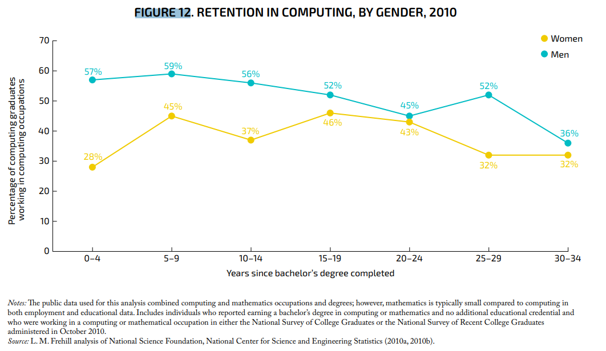
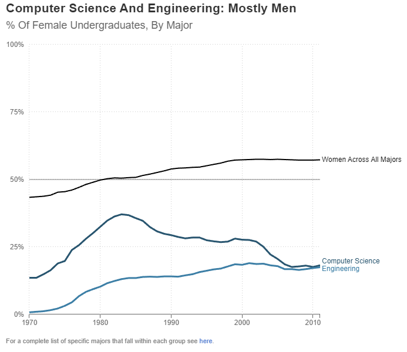
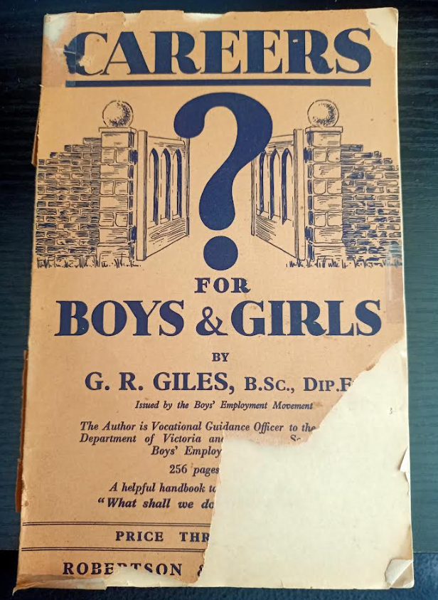
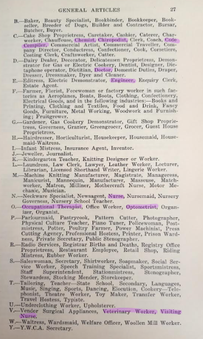
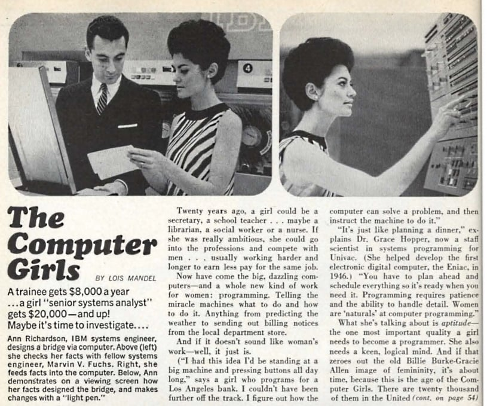
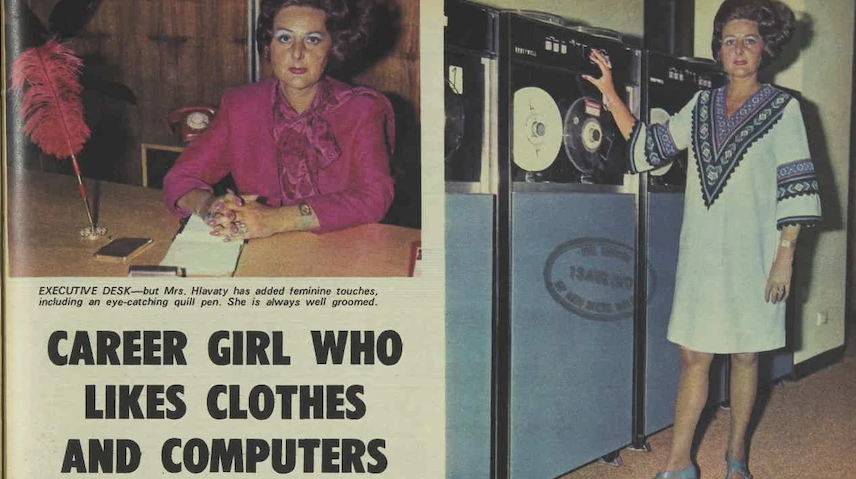
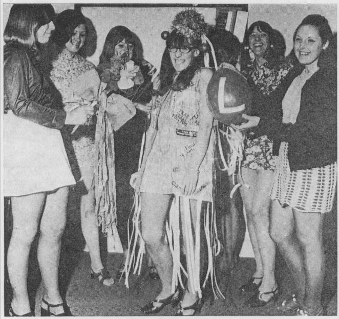
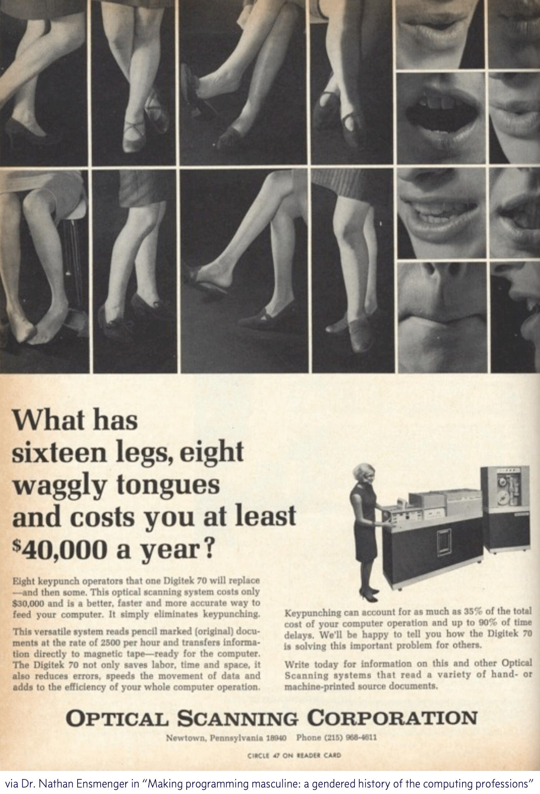
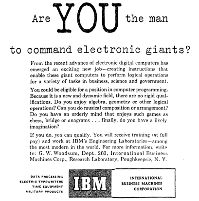
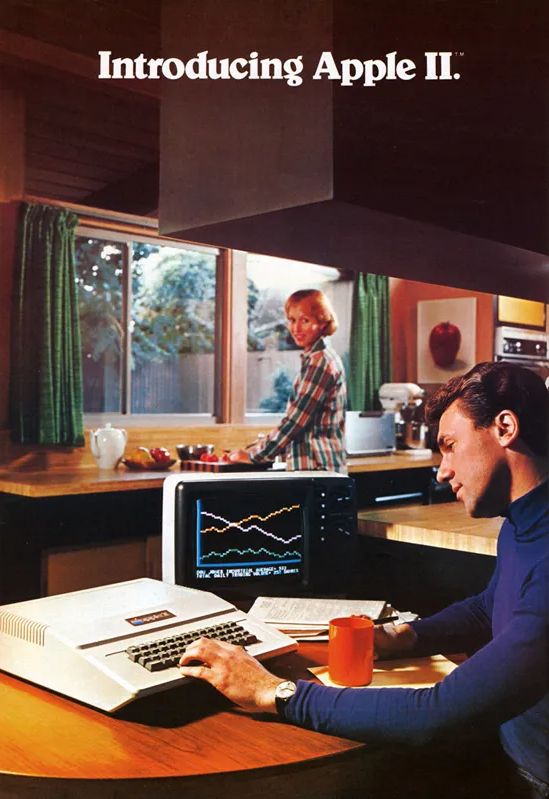

# What's this post?

I was invited to talk to a group of high-school students for International Women's Day at [Casey Tech School][1] in 2023. I invite you to check out the [Google Slides][2] I presented for this event if you're interested, but all content will be covered below in a similar format. 

# Cracking the Code: Innovation for a Gender Equal Future

> "Humans are allergic to change. They 
> love to say, **'We've always done it 
> this way.'** I try to fight that. That's
> why I have a clock on my wall that
> runs counter-clockwise.”
>
> Admiral Grace Murray Hopper, 
> Computer Pioneer

## What is International Women's Day? 
[International Women's Day (IWD)][3] falls on March 8th in the United Nations (UN) calendar. The day is committed to advancing the outcomes of women globally, across a variety of challenges, including but not limited to:

* Economic participation,
* Academic participation,
* Reproductive rights,
* Domestic Violence and violence against women,
* Equality at work and at home.

The 2023 theme is *"Cracking the Code, Innovation for a Gender equal Future"*, focussing on how we use STEM (Science, Technology, Engineering & Mathematics) to advance women's outcomes, and how we bridge the digital gap for women - [women in low and middle income countries are on average 18% less likely to have a smartphone than men, and 7% less likely to have a mobile compared to men.][4]

### Intersectionality 
It should be noted that this blog will focus on women in STEM in the U.S., U.K., and Australia, but it doesn't at all diminish the experiences of other marginalised groups in tech, including:

* People of colour,
* People for whom English is a second, third or tenth language,
* Gender diverse and gender non-conforming folks,
* People with disabilities, chronic illnesses, or caring responsibilities,
* First Nations peoples,
* People from low-socioeconomic backgrounds,
* Members of the queer and LQBTQIA+ community,
* And others! 

Many of the challenges faced by women are the same or amplified for people across these intersectional groups, and diversity, equity and inclusion efforts need to address them all.

I'd also comment that many of the challenges women face within STEM extend beyond STEM. 

## Stats & Facts

So where are the gaps for women? There's a billion horrifying statistics you can look at, but here are a few that jumped out to me as interesting.

* [Globally, women make up just 19.9% of science and engineering professionals.][5] - less than 1/5th! 
* [In the U.S., only 28% of women with computing degrees reported working in a computing job a few years after graduating, compared to 57% of men.][6]

* [After about 12 years, 50% of women employed in STEM had exited to other fields][7], compared to 20% of women in non-STEM fields. A majority of these women are from engineering and computing domains.
* [33.9% of staff at Google globally are women.][8]
* [37.5% of staff at Facebook globally are women. Of the technical staff, women represent only 24.8%.][9]
* [According to a 2019 global report][10], women received 54% of all degrees; the share of humanities, arts and social sciences degrees undertaken by women was 54%, while STEM was undertaken by a share of only 30% women. 

These are some sobering statistics - but we're getting better, right? There's a variety of encouraging programs for women in STEM

While I studied philosophy at university, one of the things that became apparent was that every author assumed their period in time was surely the best - that they were more advanced than any society had ever been before, and that progress was inevitable. Unfortunately, this simply isn't always the case - while women's participation in STEM subjects and other male dominated fields has increased over time, computational and engineering degrees are left in the lurch. More women graduated with computing degrees in the 80s than they do today!

[In the United States in 1984][11], computer science grads were composed of 37% women; [in 2018, that number was less than 20%.][12] 

Aussie stats aren't any better - [women make up just 1/5th of technology graduates][13].

## Herstory 
### Careers for Boys and Girls - Women in STEM in 1930s Australia 

I picked up this lovely book at an op-shop a few years ago!

[Careers for Boys and Girls Cover](./images/IWD/careers-for-boys-and-girls-cover.png)

>“Careers for Boys and Girls” 
>
>By G.R. Giles, B.Sc., Dip. Ed.
>
>Vocational Guidance Officer, Education Department, Victoria and
> 
>Hon. Secretary, Boys’ Employment Movement
>
>1936

It details the variety of careers available in Victoria Australia in 1936, and provides advice on training and education, writing cover letters, and what the workforce is like. Many of the jobs within have special sections or advice for women entering the workforce. I've tried to focus on the STEM portions of the book here, though there is a gnarly section detailing the different pay grades for male and female teachers. 

I've also tried to minimise images and transcribe as much as possible - for photos of these sections, refer to the [Google Slide deck][1]. 

This special section is titled "Careers for Girls" - there are no STEM careers listed under the letter A on the overleaf, so I've highlighted the STEM careers available from B-Z here:

Under health and life sciences, we have:

* Chiropodist,
* Doctor,
* Nurse,
* Veterinary worker,
* Visiting nurse,
* Occupational therapist,
* Optometrist. 

Let's zoom into some of the listings for these professions later in the text.

**Opportunities for women - doctors**

> Throughout the course there is no sex discrimination, women being admitted to the lectures and hospital work on equality with men. An increasing number of women is taking up this profession, and, with the decay of the prejudice against women doctors, there are opportunities for them in many fields. 

**Openings for women - optometry**

> It is estimated that in normal years there should be vacancies for about 50 boys and 10 girls annually. 
> 
> [...]
> 
> During the last few years an increasing number of women have entered the profession, which appeals to girls. Conditions of training apply equally to men and women; the number of openings for women in this field is, however, limited. 

Huh - weird. 

**Openings for women - Veterinary Surgery**
> In 1934, there were almost 100 students in this course at the Sydney University, including 6 women. The opportunity for women practitioners in veterinary surgery is thought to lie in the treatment of the smaller animals, rather than in general country practice, where prejudice and certain practical difficulties may have to be encountered.
>
> [...]
>
> It is not easy to indicate the emoluments for women, in view of the pioneer stage of the profession, as far as they are concerned. 

Interestingly, in Australia in 2016, [80% of veterinary science graduates and 60% of practitioners were female.][14] 

Moving out of the life sciences, we also see some other STEM careers highlighted for women - namely:

* Chemistry,
* Engineering,
* Code compiler.

Zooming into these professions...

** Opportunities for Women - Chemistry**
> Women are admitted on an equality with men to the professional courses of training, but openings for women in this field are usually restricted to laboratory work, for which they are particularly fitted."

**Engineering**
Make no mistake - engineering was for men. The text always refers to the young engineer with male pronouns and it doesn't have a cute little "opportunities for women" section like other fields do. 

What it does have is a section for factory work where women are subject to some unique rules: 

* "A child is a boy under the age of 14 years, or a girl under the age of 15." 
* "No female of any age shall be employed in any lead process."
* "No girl under 18 may be emploted in melting or annealing glass."
* "No girl under 16 may be employee in the making or finishing of bricks [...] or in salt works." 
* "No male under the age of 18, and no female of any age, may be employed in wet spinning unless sufficient means for the protection of workers is provided."
* "No girl under the age of 18 years is permitted to carry or lift a weight over 25lbs."

** Code compilers ** 
Wait, compilers didn't even exist in 1936! 

After a slew of googling, I've come to the conclusion this was likely a clerical job around coding paperwork properly. Women must have been our earliest manual database administrators.

So we've had a look at the ...long list of STEM careers available to women in the 1930s Australia. Let's zoom ahead to the 1940s and 1950s and see how women started to dominate jobs as actual code compilers. 

### The Computer Girls

A 1967 Cosmopolitan Magazine explains how women are ideal for the world of computing. 

> Twenty years ago a girl could be a secretary, a school teacher . . . maybe even a librarian, a social worker, or a nurse. If she was really ambitious, she could go into the professions and compete with men, usually working harder and longer to earn less pay for the same jobs.
>
> [...]
> And if it doesn't sounds like woman's work - well, it just is.
>
> [...]
>
> It's just like planning a dinner," explains Dr. Grace Hopper [...] " You have to plan ahead and schedule everything so it's ready when you need it. Programming requires patience and the ability to handle detail. Women are 'naturals' at computer programming."

Similarly, a 1963 edition of *Datamation* magazine wrote that "women have greater patience than men and are better at details, two prerequisites for the allegedly successful programmer."][18] and that "women are less aggressive and more content in one position."

And don't be fooled into thinking the phenomenon was limited to the U.S. and U.K. - Australia had its own computer women, many working in astronomy. I highly encourage you go and read this ABC Article titled [*The hidden stories of Australia's first women working in computing*][15]. The article features this wonderful image of Lee Hlavaty from the 26th August 1970 Women's Weekly issue which is not on our current timeline, but is too good to not share:

Anyway, back to the 40s and 50s. 

The first programmable electronic computer (ENIAC, the Electronic Numerical Integrator and Calculator) was built by men [but programmed by a majority of women][16]. In fact, six of the first programmers included:

* Kay McNulty
* Ruth Lichterman
* Jean Jennings
* Betty Snyder
* Marlyn Wescoff
* Fraces Bilas.

This wasn't out of the ordinary - following WWII, in the 1950s [women made up 30 to 50 per cent of programmers][17]! 

### Why computing is women's work
Now hold your horses - programmers of this time weren't highly paid and respected intellectuals - these women were viewed as clerical staff, aligned with typists or stenographers. The lucrative and respected work was in the man's work of building the hardware (remember our engineering section from earlier?)

The women in these roles (and earlier arithmetic roles) were referred to as "computers", and in the 1960s [IBM UK even measured their computing outputs in "girl hours"][19]. 

This excerpt [from a Guardian article][20] with quotes from Marie Hicks says it better than I can: 

> “Computers were expensive and using women to advertise them gave the appearance to managers that jobs involving computers are easy and can be done with a cheap labour force,” explains technology historian Marie Hicks. They might have been on a typist’s salary, but women like the one who appears alongside Susie and Sadie were not typists – they were skilled computer programmers, minus the prestige or pay the modern equivalent might command. 
>
>
> [...]
>
> Managers perceived women to be ideal for the computing industry because they didn’t think they needed to be offered any sort of career ladder, explains Hicks. “Instead the expectation was that a woman’s career would be kept short because of marriage and children – which meant a workforce that didn’t get frustrated or demand promotions and higher wages.”

Oh. Right. So women dominated tech precisely because they could be exploited for cheaper labour, and then forgotton about when they had early retirements to get married and have children. This image of a young decked out in computer tape at a retirement party is relevant here:

This was extremely common - here in Australia, married women weren't ALLOWED to work in the public service once they were married, [until the marriage bar was raised in 1966][21]. 

### What has 16 legs, eight waggly tongues, and costs you at least 40k a year? 

As time passed by through the 1960s, the importance of computer programming became obvious. With the additional respect the field wielded, men began joining the workforce at higher payrates and with promises of career progression. Alongside this increase in respect for computing came the legitimisation of the field with stronger higher education requirements, the formation of professional associations, and the expectation that computing staff would want to climb the career ladder - something women were exempt from. 

[Historian Nathan Ensmenger, author of "The Computer Boys Take Over", puts it succinctly]:

> An activity originally intended to be performed by low-status, clerical – and more often than not, female – computer programming was gradually and deliberately transformed into a high-status, scientific, and masculine discipline.

As part of this legitimisation of the field came career aptitude tests - the System Development Corporation (SDC) had two psychologists, William Cannon and Dallis Perry, [create a vocational interest scale][23]. They interviewed 1400 engineers (1200 of which  were men) to generate the test. As you might imagine, women didn't perform especially well on this assessment.

The main finding was that programmers shared a strong "disinterest in people". 

[A Wall Street Journal article][24] demonstrates how women were pushed out of the field in the 60s:

> Memos from the U.K.’s government archives reveal that, in 1959, an unnamed British female computer programmer was given an assignment to train two men. 
>
> The memos said the woman had “a good brain and a special flair” for working with computers. Nevertheless, a year later the men became her managers. Since she was a different class of government worker, she had no chance of ever rising to their pay grade.

### Are YOU the man to command electronic giants?

In 1968 Richard Brandon summarises the average programmer into a stereotype the modern day audience can compeltely understand. As recorded in the 1969 ACM National Conference Proceedings:

> …the personality traits of the average programmer almost universally reflect certain negative characteristics. The average programmer is excessively independent-sometimes to the point of mild paranoia.
>
> He is often egocentric, slightly neurotic, and he borders upon a limited schizophrenia. The incidence of beards, sandals, and other symptoms of rugged individualism or nonconformity are notably greater among this demographic group. Stories about programmers and the  attitudes and peculiarities are legion, and do not bear repeating here.

Richard goes on to explain that these negative traits are directly correlated to aptitude tests singling out the most logical individuals. He comments:

> Many people with the logical aptitude to pass numeric or spatial relations tests do not have the basic ability to become part of an effective and productive programming team. 

How can you tell if a programmer is extroverted?
They look at your shoes instead of their own. 

Despite these changes, we saw increasing amounts of women doing computing degrees until the mid-80s. So what happened that was worse than the beard-growing and sandal-having personalities identified in the late 60s? 

### What happened in the 1980s?

In 1981, IBM launches the personal computer, and shortly thereafter Apple releases the Macintosh - suddenly, people have access to computers in the home! 

Marketing in the era is often aimed at boys and men, showcasing these PCs as toys or hobby machines, aligned with the masculine arcade culture of the period. [Jane Margolis did a study in the 1990s][25] which showed that families were more likely to buy computers for their boys, even if the girls were interested in them. 

Prior to the release of the PC, computer science students all usually started from the position of having no experience with computers. Suddenly, some of the students had prior knowledge - and most of them were boys.

[Patricia Ordóñez][26] recounts her experience as a woman heading into computer science in the 80s, realising she was already "behind" her male colleagues.

> The professor stopped and looked at me and said, 'You should know that by now,' she recalls. "And I thought 'I am never going to excel.'

Patricia eventually moved to majoring in foreign languages. 

There are many theories as to the downturn in women in tech which occured in the 80s, but many of them turn to these massive cultural (Revenge of the Nerds, anyone?) and academic changes, transforming computing into a very male space. 

## Innovations 

> A lot of the studies have focused on fixing women—fixing their confidence, fixing their interests. We did not find that any of those factors influenced women engineers’ persistence decisions at all, which is why we are saying we really need to be focusing on the environment. 
>
> Nadya A. Fouad

Right - so we've seen that there aren't enough women in tech, that the numbers are actually down compared to the 50s and 60s, and started to understand why women may not have pursued these degrees and careers. But the theme of IWD is all about innovation to address these issues - we can fix this with more technology, right?

### WRONG. 

I did a lot of reading on this topic before giving this talk - and I simply don't believe the problem here is the lack of technology, or lack of studies on women's participation and retention in STEM, at least not in developed nations. Let me tell you about two innovations to demonstrate my point.

### The Work-From-Home women - U.K.
In 1960s England as women were pushed out of technology, [Stephanie Shirley dared to be different][27], starting her own company: Freelance Programmers. In short, she gathered a workforce of mostly women who worked from home - a rarity in this time. She also pioneered the ability for career-re-entry and job sharing arrangements, offering an attractive workplace for other women like her - 297 out of her first 300 staff were women. 

Much of the programming of this era was done on paper, with limited need for actual computer time, so women were able to work from home and balance their domestic duties and childcare. After an initially challenging sell, Shirley started going as "Steve" on business communications, a move which worked especially well for her. 

[1]: <https://www.caseytechschool.vic.edu.au/pages/home.aspx> "Casey Tech School"
[2]: <https://docs.google.com/presentation/d/1I8_W4aawpmaH_tIxa2p9SUCgi-OId4f-kFbSrV5EIwk/edit?usp=sharing> "Google Slides presentation"
[3]: <https://unwomen.org.au/get-involved/international-womens-day/> "United Nations website for International Womens Day"
[4]: <https://www.gsma.com/r/gender-gap/> "The Mobile Gender Gap Report 2022, GMSA" 
[5]: <https://www.unwomen.org/sites/default/files/2022-09/Progress-on-the-sustainable-development-goals-the-gender-snapshot-2022-en_0.pdf> "PROGRESS ON THE SUSTAINABLE DEVELOPMENT GOALS, THE GENDER SNAPSHOT 2022, UN Women"
[6]: <https://www.aauw.org/app/uploads/2020/03/Solving-the-Equation-report-nsa.pdf> "The American Association of University Women (AAUW), Solving the Equation, 2020"
[7]: <https://pubmed.ncbi.nlm.nih.gov/25554713/> "Glass, J. L., Sassler, S., Levitte, Y., & Michelmore, K. M. (2013). What’s so special about STEM? A comparison of women’s retention in STEM and professional occupations. Social Forces, 92(2), 723–56. doi:10.1093/sf/sot092."
[8]: <https://about.google/belonging/diversity-annual-report/2022/representation/> "Diversity Annual Report, 2022: Representation at Google" 
[9]: <https://about.fb.com/news/2022/07/metas-diversity-report-2022/> "Embracing Change Through Inclusion: Meta’s 2022 Diversity Report."
[10]: <https://www.timeshighereducation.com/sites/default/files/the_gender_equality_report_part_1.pdf> "The Gender Equality Report, UNESCO International Institute for Higher Education in Latin America and the Caribbean (IESALC) and Times Higher Education"
[11]: <https://www.npr.org/sections/money/2014/10/28/359419934/who-studies-what-men-women-and-college-majors> "Who Studies What? Men, Women And College Majors"
[12]: <https://ncses.nsf.gov/pubs/nsf21321/table/5-1> "Department of Education, National Center for Education Statistics, Integrated Postsecondary Education Data System, Completions Survey, unrevised provisional release data, accessed 14 January 2020."
[13]: <https://www.monash.edu/__data/assets/pdf_file/0005/2748515/Women-in-STEM-and-IT-Report.pdf> "Women in STEM and IT Report , Monash University"
[14]: <https://animalemergencyservice.com.au/blog/women-in-the-veterinary-industry/> "Women ‘Slaying’ it in the Veterinary Industry"
[15]: <https://www.abc.net.au/news/science/2019-12-01/women-computing-astronomy-technology/11713282> "The hidden stories of Australia's first women working in computing, ABC"
[16]: <https://www.researchgate.net/publication/267456246_Recoding_Gender_Women's_Changing_Participation_in_Computing_J_Abbate_MIT_Press_Cambridge_MA_2012_247> "Recoding Gender: Women's Changing Participation in Computing, J. Abbate MIT Press, Cambridge, MA (2012)"
[17]: <https://thewisdomdaily.com/women-used-to-dominate-tech-until-men-pushed-them-out/> "WOMEN USED TO DOMINATE TECH… UNTIL THEY WERE PUSHED OUT, The Wisdom Daily" 
[18]: <https://www.smh.com.au/lifestyle/life-and-relationships/women-were-the-first-computer-programmers-then-men-crowded-them-out-20170822-gy1e8r.html> "Women were the first computer programmers, then men crowded them out, SMH"
[19]: <https://logicmag.io/failure/how-to-kill-your-tech-industry/> "How To Kill Your Tech Industry, Mar Hicks"
[20]: <https://www.theguardian.com/careers/2017/aug/10/how-the-tech-industry-wrote-women-out-of-history> "How the tech industry wrote women out of history"
[21]: <https://www.naa.gov.au/learn/learning-resources/learning-resource-themes/government-and-democracy/appointment-women-commonwealth-public-service-note-cabinet-discussion> "Appointment of women to the Commonwealth Public Service – Note for Cabinet discussion"
[22]: <https://www.smh.com.au/lifestyle/life-and-relationships/women-were-the-first-computer-programmers-then-men-crowded-them-out-20170822-gy1e8r.html> "Women were the first computer programmers, then men crowded them out, SMH" 
[23]: <https://www.washingtonpost.com/outlook/2019/02/19/women-built-tech-industry-then-they-were-pushed-out/> "Women built the tech industry. Then they were pushed out., Washington Post"
[24]: <https://www.wsj.com/articles/the-first-women-in-tech-didnt-leavemen-pushed-them-out-1512907200> "The First Women in Tech Didn’t Leave—Men Pushed Them Out"
[25]: <https://www.aauw.org/app/uploads/2020/03/Solving-the-Equation-report-nsa.pdf> "The American Association of University Women (AAUW), Solving the Equation, 2020"
[26]: <https://www.npr.org/sections/money/2014/10/21/357629765/when-women-stopped-coding> "When Women Stopped Coding, NPR"
[27]: <https://www.steveshirley.com/story/> "The Steve Shirley Story"
